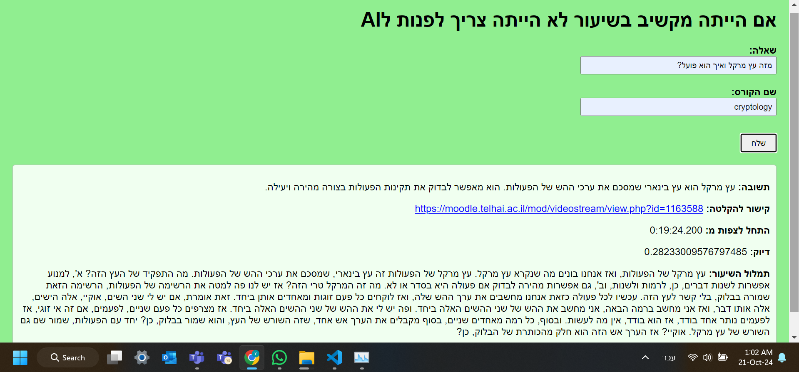
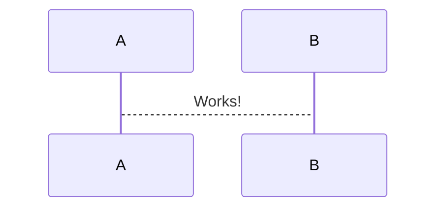

# Students' Study Buddy Chatbot
## A RAG Project for University Students

#### Table of Contents
1. [Project Overview and Key Features](#project-overview-and-key-features)
4. [Project Architecture and Design](#project-architecture-and-design)
5. [Installation Instructions](#installation-instructions)

## Project Overview and Key Features

The **Students' Study Buddy Chatbot** is a tool designed to assist university students by answering questions about their lecture content. <br>
The chatbot provides students with accurate, context-based responses along with a link to the relevant lecture recording, as you can see in the image for example.

### Project Web Page Interface




## Key Features:

- **Lecture Transcriptions**: Converts lecture recordings into text using speech-to-text technology using [Ivrit-ai](https://huggingface.co/ivrit-ai/faster-whisper-v2-d3-e3)'s model.
- **Database Storage**: Transcriptions are chunked and stored in a database for easy retrieval. 
- **Question Answering**: Uses a Large Language Model (LLM) to answer questions based on the stored transcriptions.
- **Web Interface**: Students can interact with the chatbot via a simple web interface.

## Modular design 
Through extensive use of the [Langchain](https://www.langchain.com/) framework, which enables flexible integration with different database backends and LLM models.

Allows for the use of various vector databases, such as: 
- **FAISS**
- **Pinecone** 
- **Milvus**
 - **Chroma**
 - **Elasticsearch**<br>

And also the usage of various llm models:
- Various **[HuggingFace](https://huggingface.co/)**  models
- **[Gemini's api](https://ai.google.dev/gemini-api/docs/api-key)**
    


## Project Architecture and Design


The project is divided into three main components:

### 1. **MP4 Audio Transcriber**
   - **Purpose**: Extracts audio from MP4 video recordings and transcribes it into text.
   - **Key Files**: 
     - `main.py`: The entry point for transcribing MP4 lectures.
     - `mp4_transcriber.py`: Handles the audio extraction and transcription using speech-to-text tools. 


### 2. **Database Management**
   - **Purpose**: Manages the storage and retrieval of lecture transcription chunks.
   - **Key Files**:
     - `app.py`: Sets up the API endpoints for storing and retrieving transcription chunks.
     - `chunking_manager.py`: Splits lecture transcriptions into manageable pieces (chunks) for efficient storage.
     - `database_manager.py`: Manages the connection and interaction with the database.

### 3. **LLM Integration and Chat Interface**
   - **Purpose**: Allows students to ask questions, retrieves relevant transcription chunks, and generates answers using the LLM.
   - **Key Files**:
     - `app.py`: Starts the web server to serve the chatbot interface.
     - `chat_bot.py`: Processes student questions, queries the database for relevant transcription data, and generates responses.
     - `index.html`: The web interface for students to interact with the chatbot.


## Installation Instructions

### Prerequisites
- Required Python libraries (listed in `requirements.txt`)
- FFmpeg (for extracting audio from MP4 files)

### Setup Steps
1. **Clone the repository and install requirements**:
   ```bash
   git clone https://github.com/yaniv-simmer/students-study-buddy-chatbot.git
   cd students-study-buddy-chatbot
   pip install -r requirements.txt
   ```


2. Run each of the components `database/app.py`, `mp4_audio_transcriber/main.py`, `llm_integration/app.py` separately.

3. Access the Web Interface: Open a browser and navigate to http://localhost:5000 to interact with the chatbot.

<br>

---
